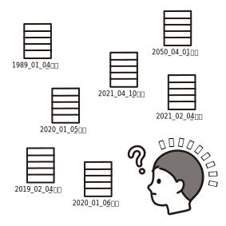

<!--
class: title
-->

# **ハンズオン! Github 講座**

MoveOnHackathon2 by がっしー

---

<!--
_class: body
-->

# 対象

- MoveOnHackathon2 の参加者
- Git・Github に触れたことがない初心者

---

<!--
class: body
-->

# 目次

- Git ってなんだ?

---

# Git ってなんだ?

Git の公式 HP を見てみると、

> Git is a free and open source distributed version control system designed to handle everything from small to very large projects with speed and efficiency.
> https://git-scm.com/

と書いてある。

---

# Git = 分散型バージョン管理システム

**バージョン管理システムとは**
過去のファイルを残しておき、変更を管理するためのシステム！

<h3>
  🙅 無い場合
  
<h3>
  🙆 ある場合
  

---

