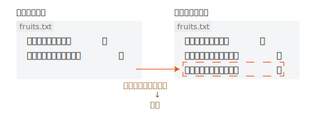

# **ハンズオン! Github 講座**

MoveOnHackathon2 by がっしー

---
<!--_class: body-->

# 対象

- MoveOnHackathon2 の参加者
- Git・Github に触れたことがない初心者

---
<!--_class: body-->

# 目次

- Git について
- 実際にコマンドを入力してみよう
- +αの使い方を知ろう

---
<!--_class: body-->

# Git ってなんだ?

Git の公式 HP を見てみると、

> Git is a free and open source distributed version control system designed to handle everything from small to very large projects with speed and efficiency.
> https://git-scm.com/

と書いてある。

---
<!--_class: body-->

# Git = 分散型バージョン管理システム

**バージョン管理システム...**
過去のファイルを残しておき、変更を管理するためのシステム

<div class="split">
<h3>
  🙅 無い場合
  
<h3>
  🙆 ある場合
  
</div>

---
<!--_class: body-->

# 差分とは?

バージョン管理システムは，コードなどの**変更を管理**
そのため、変更前と変更後の**差分**という考え方でデータを保管!



---
<!--_class: body-->

# 差分とは?

追加された・変更された・削除された部分を保存することで、
どのような**更新**をおこなったか知れる！

> この差分を保存するときに使うのがコミット！！

---
<!--_class: body-->

# コミットってなんだ？

差分を記録するための操作 = コミット


---
<!--_class: body-->

# コミットが集まると..!?

<div class="split">
<div>
  コミットは、
  <ul>
    <li>ハッシュ
    <li>コミットの作成者
    <li>コミット日時
    <li>コミットメッセージ
  </ul>
  が保存される。<br><br>

つまり、これを続けるといい感じに情報が**時系列**でつながる

</div>

</div>

---
<!--_class: body-->

# コンフリクトとは

---
<!--_class: body-->

# Git と Github の違い

---

# 実際に使ってみよう！

---
<!--_class: body-->

# 注意書き

```bash
# コメントアウト
$ git init
```

**入力しなくていい文字**
「#の後についている文」→コメントアウトと呼ばれるもの
「$」→はコマンドラインで打ってることを示してるだけ

---
# Github の登録
完了してなかったら教えてねー！

---
<!--_class: body-->

# PC の環境設定

```bash
$ git config
```

---
<!--_class: body-->

# Git を使おう

```bash
# gitを初期化
$ git init

# すべてのファイルを追加
$ git add .

# addで追加されたファイルをメッセージ付きでコミット
$ git commit -m “メッセージ”

# 現在の状態を確認
$ git status
```

---
<!--_class: body-->

# ローカルのGitとGithubを繋げよう
## 1. Githubで新しいリポジトリをつくろう
- リポジトリ名
  - 「git-practice-メンター名」にしてみよう！
- 権限設定（Public / Private）
  - Public…全世界に公開
  - Private…自分と招待したメンバーのみ見られる

---
<!--_class: body-->

# ローカルのGitとGithubを繋げよう
## 2. remoteコマンドで繋げよう
```bash
# ブランチを設定しよう！（今は理解できてなくて大丈夫）
$ git branch -M main

# originの後は、1でつくったURLに変えてね！
$ git remote add origin https://github.com/penguin4731/git-practice-gassi.git
```

## 3. pushしよう
```
$ git push origin main
```

---
<!--_class: body-->

# git pullを体験しよう

---

# +αの使い方
ブランチやプルリクエストについて
※ここまでの内容を復習しておいても大丈夫！

---
<!--_class: body-->

# ブランチってなんだ？

---
<!--_class: body-->

# プルリクエストとは

---

# 実際に触ってみよう

---
<!--_class: body-->

# ブランチを作成して切り替えよう

```bash
# ブランチを作成
$ git branch branch_name

# 作成したブランチに切り替える
$ git checkout branch_name
```

> ```$ git switch -c branch_name```でもできる！地味におすすめ
> branch_nameは、ブランチの名前なので自由に決めよう！

---
<!--_class: body-->
# プルリクエストを出してみよう

---
<!--_class: body-->
# プルリクエストをマージしてみよう
## コードレビューしてみよう
---

# ご清聴ありがとうございました!!
少しでもお役に立てればうれしいです！
ちなみに、このスライドはコードから生成してます！！https://github.com/penguin4731/git-practice

